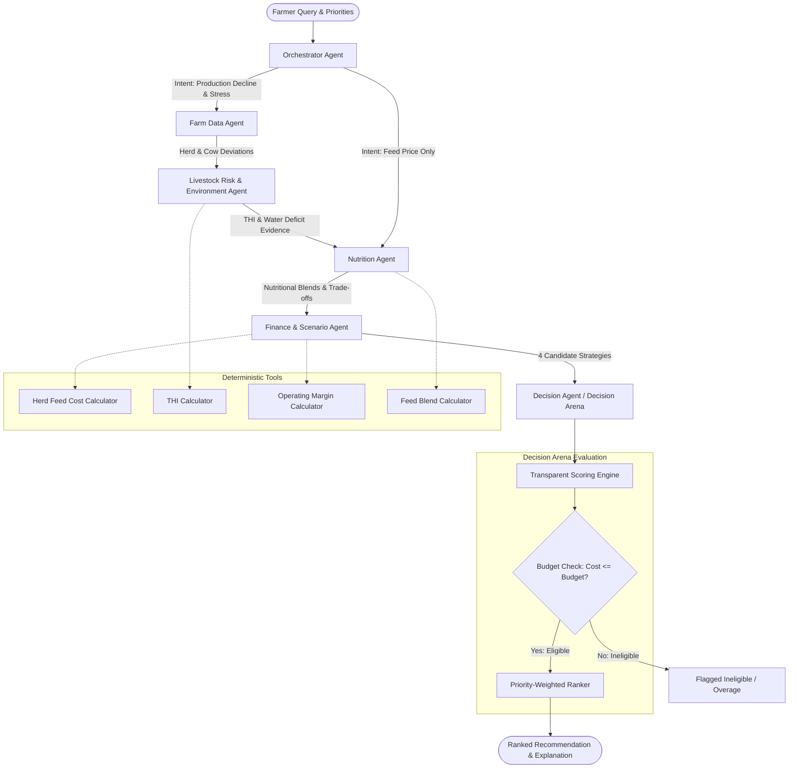

# FarmWise Multi-Agent Decision Engine Architecture

**Tagline**: *Your experience. More evidence. Better farm decisions.*  
**Orchestration Engine**: LangGraph Stateful Graph  
**Execution Runtime**: Python 3.12 / FastAPI / SQLite  

---

## 1. High-Level System Architecture

FarmWise is an autonomous agentic decision-support engine designed specifically for livestock farming. Unlike generic chatbots, FarmWise separates natural language interpretation, empirical evidence retrieval, deterministic arithmetic calculations, and multi-criteria strategy evaluation.



---

## 2. Specialized Agent Roles & Responsibilities

### A. Orchestrator Agent (`app/agents/orchestrator.py`)
- **Core Responsibility**: Analyzes farmer natural language input and priorities, extracts intent, and formulates a structured execution task plan.
- **Conditional Routing**:
  - *Pure Feed Price Query* (e.g., "Grain prices rose, what substitute to buy?"): Routes directly to `Nutrition` -> `Finance` -> `Decision`, bypassing extraneous animal health processing.
  - *Production Decline / Heat / Disease Symptoms* (e.g., "Milk dropped 8% and weather is hot"): Triggers the complete 6-agent pipeline (`FarmData` -> `RiskEnvironment` -> `Nutrition` -> `Finance` -> `Decision`).
- **Output**: Intent classification, agent selection list, structured task plan, routing reason.

### B. Farm Data Agent (`app/agents/farm_data.py`)
- **Core Responsibility**: Accesses synthetic herd management records from SQLite.
- **Analysis**:
  - Computes 14-day production delta (-7.87% milk drop: 445L baseline down to 410L).
  - Analyzes herd water consumption drop (-17.95%: 78L down to 64L/cow/day).
  - Differentiates herd-wide patterns from individual animal anomalies (flags Cow `KA-MAN-104` with 39.9°C fever and feed refusal; flags Cow `KA-MAN-112` with early mastitis signs).
- **Integrity**: Emits explicit missing-data warnings (e.g., absence of stall-level water meters; bulk tank milk metering only).

### C. Nutrition Agent (`app/agents/nutrition.py`)
- **Core Responsibility**: Inspects current herd ration and evaluates raw feeds from the Karnataka feed catalog.
- **Analysis**:
  - Models nutritional consequences of concentrate price inflation (+17.86% price hike on 20% CP dairy pellets).
  - Evaluates alternative agro-byproducts (DORB, cracked maize, corn silage).
  - Critiques the farmer's traditional heuristic ("cut concentrate, feed more green grass"): notes that high-moisture Napier grass (80% water, 8.5% CP) cannot replace concentrate energy density (72% TDN), worsening negative energy balance (NEB).
- **Integrity**: Never fabricates nutrient values; all data originates from NDDB/ICAR benchmark standards.

### D. Livestock Risk and Environment Agent (`app/agents/risk_environment.py`)
- **Core Responsibility**: Monitors ambient weather, shelter conditions, and animal health indicators.
- **Analysis**:
  - Calculates NRC Temperature-Humidity Index (THI): Ambient temp 35.5°C + 68% RH yields THI 86.8 (Moderate-to-Severe heat stress).
  - Correlates high ambient temperature with declining water intake (heat-stressed cows require 95-110L water; cows drinking only 64L indicates hot trough water or biofilm contamination).
- **Safeguards**:
  - **MANDATORY**: Does NOT diagnose diseases or prescribe medication.
  - Emits urgent veterinary physical examination escalation flags for sick cows.

### E. Finance and Scenario Agent (`app/agents/finance.py`)
- **Core Responsibility**: Generates deterministic financial projections for 4 candidate strategies.
- **Arithmetic Integrity**: All calculations are performed in deterministic Python functions (`calculate_herd_feed_cost`, `calculate_milk_revenue`, `calculate_daily_margin`). An LLM is never trusted with arithmetic.
- **Candidate Strategies Generated**:
  1. *Farmer's Traditional Approach*: Reduce concentrate to 2.5kg, increase Napier to 24kg.
  2. *Feed Adjustment*: Reformulate ration with 3.0kg concentrate, 1.2kg DORB (₹16/kg), 0.4kg maize (₹24.5/kg).
  3. *Cooling & Water Intervention*: Keep current feed ration, invest ₹200/day in misting fans and trough hygiene.
  4. *Hybrid Synergistic Strategy*: Moderate feed substitution (save feed bill to ₹4,614) + low-cost shade net & fresh water protocol (₹130/day).

### F. Decision Agent (`app/agents/decision.py`)
- **Core Responsibility**: Hosts the Decision Arena.
- **Evaluation Criteria**: Affordability, Animal Welfare, Financial Impact, Risk Level, Operational Feasibility.
- **Enforces Hard Constraints**: Rejects strategies whose daily cost exceeds `budget_inr`.
- **Ranks and Explains**: Explains why the winning option was chosen, why alternatives ranked lower, and summarizes priority sensitivity.

---

## 3. Decision Arena Scoring Formula

The scoring engine evaluates each candidate strategy across 5 dimensions on a 0-100 scale:

| Dimension | Raw Evaluation | Scoring Logic |
|---|---|---|
| **Affordability** | Cost vs Budget | `100 - (Cost / Budget * 40.0)` if `Cost <= Budget`; `0.0` (Ineligible) if `Cost > Budget` |
| **Animal Welfare** | Hydration & Health | Score based on thermal comfort, hydration adequacy, and rumen buffer |
| **Financial Impact** | Daily Margin | `70.0 + ((Margin - 10000) / 1000 * 5.0)` clamped between 10 and 100 |
| **Risk Level** | Uncertainty | Low Risk = 90.0, Medium Risk = 65.0, High Risk = 35.0 |
| **Feasibility** | Farm Operations | Easy = 90.0, Moderate = 72.0, Challenging = 45.0 |

### Priority-Weighted Formula:
$$\text{Score} = \frac{(W_{\text{cost}} \times S_{\text{afford}}) + (W_{\text{welfare}} \times S_{\text{welfare}}) + (W_{\text{profit}} \times S_{\text{finance}}) + (W_{\text{risk}} \times S_{\text{risk}}) + (W_{\text{feas}} \times S_{\text{feas}})}{W_{\text{cost}} + W_{\text{welfare}} + W_{\text{profit}} + W_{\text{risk}} + W_{\text{feas}}}$$

- Hard constraint check: If `Cost > Budget`, the strategy is flagged `eligible = false` and excluded from winning.

---

## 4. LangGraph Workflow Implementation

The execution graph is defined using LangGraph's `StateGraph`:

```python
# app/graph/workflow.py
graph = StateGraph(FarmWiseGraphState)

graph.add_node("orchestrator", orchestrator_node)
graph.add_node("farm_data", farm_data_node)
graph.add_node("risk_environment", risk_environment_node)
graph.add_node("nutrition", nutrition_node)
graph.add_node("finance", finance_node)
graph.add_node("decision", decision_node)

graph.add_edge(START, "orchestrator")
graph.add_conditional_edges("orchestrator", route_after_orchestrator)
graph.add_conditional_edges("farm_data", route_after_farm_data)
graph.add_edge("risk_environment", "nutrition")
graph.add_edge("nutrition", "finance")
graph.add_edge("finance", "decision")
graph.add_edge("decision", END)
```

---

## 5. Fallback & Offline Resilience

1. **Zero LLM Dependency**: When `GROQ_API_KEY` is not provided, the application operates in 100% deterministic rule-based mode.
2. **Crash Prevention**: All external network calls to LLMs feature timeout safeguards (`settings.LLM_TIMEOUT_SECONDS`) and catch blocks. If an API call fails, the decision engine seamlessly produces complete structured explanations.
3. **Data Provenance**: Every metric returned is traceable back to the SQLite schema or deterministic formula.
